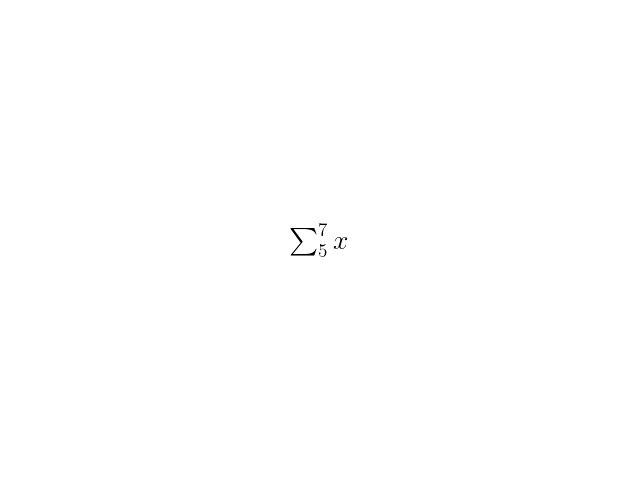

# texformer

This telegram bot handles inline requests, creating images for the LaTeX mathematical text provided.

## Dependencies

- matplotlib
- [python-telegram-bot](https://github.com/python-telegram-bot/python-telegram-bot)
- A telegram channel (can be private) for the bot to upload the images.

## Usage
Before usage, make sure to fill in the botID and the private channel ID.

Then, in any chat, type:

```
@botname $ <formula> $
```

Make sure that all the text is in the same line.

### Example

```
\sum_5^7x
```
